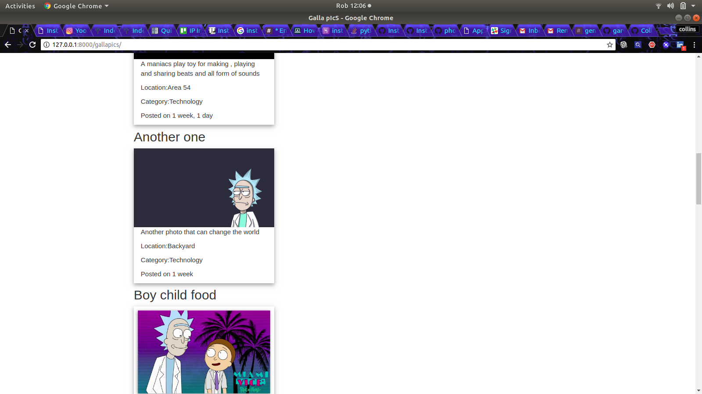

# Gallapics BY Collins Muiruri

## Description
This is a python project using django framework.It is a gallery application that you display your photos for others to see.

## Setup/Installation Requirements
* Clone  from my github(https://github.com/CollinsMuiruri/Galla-Pic)
* Install the virtual environment (python3.6 -m venv virtual)
* Activate virtual (source virtual/bin/activate)
* Install django into your local machine.
* Run pip > freeze -r requirements.txt to install dependencies.
* Create a database called galla.
* Change your directory to galla.
* Run python3.6 manage.py runserver on your terminal to run the app on your localhost which is eithetr localhost 8000 or http://127.0.0.1:8000/.

## Running the tests

(virtual):~project/path$ python3.6 manage.py test

## Built With

* [Django](https://docs.djangoproject.com/en/1.11/) - Python-django web framework.
* [psql](https://www.postgresql.org/docs/) - Database.
* [bootstrap3](https://getbootstrap.com/) - For the front end styling.
* [python](https://www.python.org/) - The language used.

## Deployment
-Heroku

## Authors

* **COLLINS MUIRURI** - [Github](https://github.com/CollinsMuiruri)

## License

This project is licensed under the MIT License - see the [LICENSE](LICENSE) file for details.
Copyright 2018 CollinsMuiruri.
